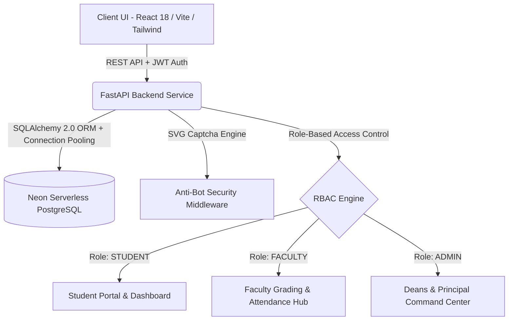

<div align="center">

# 🎓 CampusERP • Enterprise Academic & Administration Ecosystem
### *CONNECT • MANAGE • EMPOWER*

[](https://college-erp-khaki.vercel.app/login)
[](https://college-erp-backend-uzhy.onrender.com)
[](https://neon.tech)
[](https://fastapi.tiangolo.com)
[](https://reactjs.org)
[](https://tailwindcss.com)

<p align="center">
  <b>A next-generation, high-performance, role-governed Academic Management and Administration platform engineered for colleges and universities.</b>
</p>

[🌐 Live Web Portal](https://college-erp-khaki.vercel.app/login) • [📖 Interactive API Docs](https://college-erp-backend-uzhy.onrender.com/docs) • [📚 System Wiki](WIKI.md) • [🚀 Deployment Guide](DEPLOYMENT_GUIDE.md)

---

</div>

## 📌 Live Deployments & Repository

- **🚀 Production Web Portal (Vercel)**: [https://college-erp-khaki.vercel.app/login](https://college-erp-khaki.vercel.app/login)
- **⚡ Production API Server (Render)**: [https://college-erp-backend-uzhy.onrender.com](https://college-erp-backend-uzhy.onrender.com)
- **📑 OpenAPI / Swagger Documentation**: [https://college-erp-backend-uzhy.onrender.com/docs](https://college-erp-backend-uzhy.onrender.com/docs)
- **🐙 Official GitHub Repository**: [pathakpk7/College_ERP](https://github.com/pathakpk7/College_ERP)

---

## 🌟 Key Highlights & Architectural Overview

CampusERP provides a zero-compromise institutional suite connecting students, professors, departmental heads (HODs), deans, and the principal under a single unified, secure portal.



---

## ✨ Core Feature Modules

### 1. 🛡️ Role-Governed Authentication & Security
- **Multi-Identifier Login**: Authenticate seamlessly using Roll Number, permanent College ID (`UIT...`), Employee ID, Username, or institutional Email.
- **Mathematical / SVG Anti-Bot Captcha**: Real-time server-generated cryptographic challenge with rotation on failed attempts.
- **Role-Based Access Control (RBAC)**: Strict role separation between `STUDENT`, `FACULTY`, and `ADMIN`.
- **Granular Data Privacy**: Redacted peer emails in public forums and grievance ticketing desks to prevent student enumeration.

### 2. 👨‍🎓 Student Dashboard & Academic Lifecycle
- **Real-Time Attendance Intelligence**: Daily period-wise breakdown (P1–P8) with subject code mapping, faculty attribution, and automatic warning indicators when overall attendance dips below 75%.
- **Semester History & Archive**: Interactive dropdown to inspect historical semester attendance, subjects, and conducted vs. attended metrics.
- **Continuous Internal Evaluation (CIE)**: Sessional 1, Sessional 2, Makeup evaluations, maximum marks, and percentage indicators per subject.
- **Fee Management**: Semester fee logs, transaction reference numbers, receipts, and payment status tracking.
- **Digital NOC Processing**: Paperless submission and live status tracker for internship permissions, character certificates, and event clearances.
- **Placement & Training Cell**: Drive listings, CTC packages, eligibility criteria filters, and placement resources.
- **Academic Repository**: Centralized study material repository (Lecture Notes, Assignments with deadlines, Previous 5-Year Solved Question Papers [PYQs], and Contest Prep materials).

### 3. 👩‍🏫 Faculty Hub & Department Management
- **Class & Section Roster**: Filter students by Academic Year, Branch, Semester, and Section (`A`, `B`, `C`).
- **Bulk & Single Period Attendance Marking**: Mark single or entire 8-period blocks in one click with instant status recalculations.
- **Internal Assessment Grading**: Submit and update Sessional and Makeup marks with automatic score cap validations.
- **Courseware Publishing**: Upload and broadcast PDF study notes, syllabus references, and assignment deadlines targeted by year, branch, or section.

### 4. 🏛️ Administrative & Leadership Command Center
- **Executive Governance**: Dedicated administration oversight for **Principal & Director**, **Dean of Academic Affairs**, **Dean of Student Welfare (DSW)**, and **Dean Corporate & Placements**.
- **Institution Analytics**: Global student count, faculty roster, fee collection summaries, placement drives, and compliance auditing.
- **NOC Approval Workflow**: Real-time review, approval, or rejection of student clearance applications with official remarks.
- **Campus Notice Broadcasting**: Publish official institution-wide and department-specific announcements.
- **Campus Bookstore Management**: Issue and manage offline library books and student store borrow orders.

---

## 🔑 Demo & Test Credentials

You can test any role directly on the [Live Web Portal](https://college-erp-khaki.vercel.app/login):

### 🏛️ Administrators & Leadership (Password: `admin123`)
| Name | Designation | Login Identifier / Username |
| :--- | :--- | :--- |
| **Prof. Sanjay Srivastava** | Principal & Director | `principal` / `sanjay.srivastava` / `EMP001` |
| **Prof. Abhishek Malviya** | Dean of Academic Affairs | `abhishek.malviya` / `dean.academic` / `EMP002` |
| **Prof. Manas Pandey** | Dean of Student Welfare (DSW) | `manas.pandey` / `dsw` / `EMP003` |
| **Dr. Divya Bartaria** | Dean Corporate & Industry Relations | `divya.bartaria` / `dean.corporate` / `EMP004` |

### 👨‍🏫 Heads of Department (HODs) & Faculty (Password: `faculty123`)
| Name | Department | Login Identifier / Username |
| :--- | :--- | :--- |
| **Prof. Prafull Pandey** | HOD, Computer Science & Engineering | `prafull.pandey` / `hod.cse` / `EMP010` |
| **Prof. Rohit** | HOD, Information Technology | `rohit.kumar` / `hod.it` / `EMP011` |
| **Prof. Man Singh** | HOD, Civil Engineering | `man.singh` / `hod.civil` / `EMP012` |
| **Prof. Rehan Haider** | HOD, Mechanical Engineering | `rehan.haider` / `hod.me` / `EMP013` |
| **Prof. Surya Prakash** | HOD, Electronics & Comm. Engineering | `surya.prakash` / `hod.ece` / `EMP014` |
| **Arjun** | Associate Professor (CSE) | `arjun.singh` / `EMP020` |
| **Dr. Umesh Kumar Pandey** | Professor (Mathematics / Applied Sciences) | `umesh.pandey` / `EMP021` |
| **John Rizvi** | Associate Professor (IT) | `john.rizvi` / `EMP022` |
| **Sonali Kumari** | Assistant Professor (CSE AI & ML) | `sonali.kumari` / `EMP024` |
| **Shruti Sharma** | Assistant Professor (CSE) | `shruti.sharma` / `EMP023` |

### 🎓 Students
- Log in with any student Roll Number (e.g. `220101001` to `220101060`, `230101001`, `240101001`, `250101001`) or permanent College ID (`UIT220001`, etc.) with default password or standard credentials.

---

## 🗂️ Project Directory Structure

```
College_ERP/
├── backend/                        # FastAPI REST API Backend
│   ├── alembic/                    # Database migrations
│   ├── app/
│   │   ├── api/                    # RESTful Route Endpoints
│   │   │   ├── routes/             # Auth, Dashboard, Attendance, Marks, Timetable, etc.
│   │   │   └── router.py           # Unified API router
│   │   ├── core/                   # Security, JWT tokens, Settings
│   │   ├── db/                     # SQLAlchemy Session & Init
│   │   ├── models/                 # ORM Database Models
│   │   ├── schemas/                # Pydantic Request/Response validation
│   │   └── utils/                  # Enums, Captcha generation
│   ├── seed_faculty_and_admins.py  # Comprehensive database seeding script
│   ├── Dockerfile                  # Container definition for backend
│   ├── Procfile                    # Render / Railway process definition
│   ├── render.yaml                 # 1-Click Render blueprint
│   └── requirements.txt            # Python dependencies
│
├── frontend/                       # React 18 + Vite + Tailwind CSS Client
│   ├── public/                     # Logos, Favicons, Brand emblems
│   ├── src/
│   │   ├── assets/                 # SVGs and Images
│   │   ├── components/             # Layout (Sidebar, Topbar), Cards, Modals
│   │   ├── context/                # AuthContext & Session Provider
│   │   ├── pages/                  # Portal Views (Dashboard, Attendance, Marks, etc.)
│   │   └── services/               # Axios API clients
│   ├── Dockerfile                  # Production Nginx container
│   ├── vercel.json                 # Vercel SPA routing rules
│   └── package.json
│
├── docker-compose.yml              # Complete Multi-Container Orchestration
├── DEPLOYMENT_GUIDE.md             # Production Deployment Documentation
├── WIKI.md                         # Detailed System Architecture & Features Wiki
└── README.md                       # Master Project Guide
```

---

## 🛠️ Local Development Quickstart

### Prerequisites
- **Python**: `3.10` or higher
- **Node.js**: `18.x` or higher & `npm`
- **PostgreSQL**: Local instance or free [Neon](https://neon.tech) cloud database

### 1. Clone the Repository
```bash
git clone https://github.com/pathakpk7/College_ERP.git
cd College_ERP
```

### 2. Backend Setup
```bash
cd backend
python -m venv venv

# Windows
.\venv\Scripts\activate
# Linux/macOS
source venv/bin/activate

pip install -r requirements.txt
cp .env.example .env

# Start FastAPI backend server
uvicorn app.main:app --reload --host 127.0.0.1 --port 8000
```
- API Docs: `http://localhost:8000/docs`
- Health Endpoint: `http://localhost:8000/api/v1/health`

### 3. Frontend Setup
```bash
cd ../frontend
npm install
npm run dev
```
- Web Application: `http://localhost:5173`

---

## 🌐 Full Stack API Endpoints Overview

| Category | Endpoint | Method | Description |
| :--- | :--- | :--- | :--- |
| **Auth** | `/api/v1/auth/captcha` | `GET` | Generates SVG anti-bot challenge |
| **Auth** | `/api/v1/auth/login` | `POST` | Authenticates User, returns JWT & role profile |
| **Auth** | `/api/v1/auth/me` | `GET` | Retrieves current authenticated profile |
| **Student** | `/api/v1/dashboard` | `GET` | Fetches student KPIs, attendance %, CGPA, notices |
| **Attendance**| `/api/v1/attendance` | `GET` | Retrieves full 8-period attendance matrix |
| **Timetable** | `/api/v1/timetable` | `GET` | Full 6-day timetable for branch/semester/section |
| **Materials** | `/api/v1/academic-materials`| `GET` | Notes, PYQs, assignments & contest guides |
| **Marks** | `/api/v1/marks` | `GET` | Sessional 1, 2 and makeup evaluation marks |
| **Faculty** | `/api/v1/faculty/attendance`| `POST` | Marks class attendance in single or bulk mode |
| **Faculty** | `/api/v1/faculty/materials` | `POST` | Uploads and publishes courseware |
| **Admin** | `/api/v1/admin/overview` | `GET` | High-level college statistics & department metrics |
| **Admin** | `/api/v1/admin/noc-action` | `POST` | Reviews and approves/rejects student NOCs |

---

## 📄 License & Attribution

Designed and developed for academic excellence and seamless institutional governance.
Distributed under the **MIT License**. See `LICENSE` for details.
