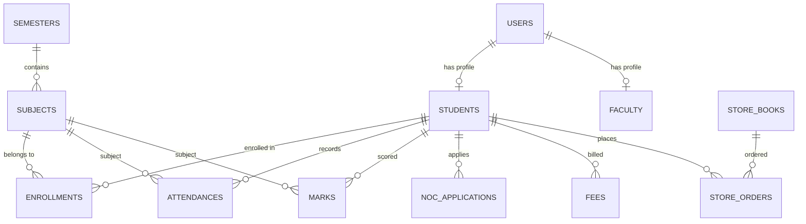

# 📖 CampusERP System Documentation & Architecture Wiki

Welcome to the **CampusERP System Wiki**. This document provides an in-depth exploration of the system architecture, domain models, role access policies, security implementations, and feature workflows.

---

## 📑 Table of Contents
1. [System Architecture & Tech Stack](#system-architecture--tech-stack)
2. [User Roles & Permissions Matrix](#user-roles--permissions-matrix)
3. [Database Schema & Data Model](#database-schema--data-model)
4. [Feature Deep-Dive](#feature-deep-dive)
   - [Attendance Engine (P1–P8 Matrix)](#attendance-engine-p1p8-matrix)
   - [Continuous Internal Evaluation (CIE / Marks)](#continuous-internal-evaluation-cie--marks)
   - [Timetable Scheduling Matrix](#timetable-scheduling-matrix)
   - [Academic Study Materials & Repository](#academic-study-materials--repository)
   - [Paperless Digital NOC Clearance](#paperless-digital-noc-clearance)
   - [Institutional Governance & Privacy Protection](#institutional-governance--privacy-protection)
5. [Security & Cryptography](#security--cryptography)
6. [API Route Specifications](#api-route-specifications)
7. [Deployment & Infrastructure](#deployment--infrastructure)

---

## 🏛️ System Architecture & Tech Stack

```mermaid
graph TD
    subgraph Frontend Tier
        Vite[Vite Bundler] --> React[React 18 SPA]
        React --> Router[React Router v6]
        React --> Tailwind[Tailwind CSS v4.0]
        React --> Axios[Axios Interceptors]
    end

    subgraph Backend Tier
        FastAPI[FastAPI Framework] --> Security[JWT Auth + Bcrypt]
        FastAPI --> Captcha[SVG Math Captcha Engine]
        FastAPI --> RouterLayer[REST API Endpoints]
        RouterLayer --> ORM[SQLAlchemy 2.0 ORM]
    end

    subgraph Persistence & Infrastructure Tier
        ORM --> Neon[(Neon Serverless PostgreSQL)]
        Vercel[Vercel CDN Edge] -.-> Frontend Tier
        Render[Render Web Services] -.-> Backend Tier
    end

    Axios -->|HTTPS /api/v1| RouterLayer
```

### Technology Highlights
- **Frontend**: React 18, Vite 5, Tailwind CSS 4, Lucide React Icons, React Router DOM.
- **Backend**: Python 3.11+, FastAPI 0.110+, SQLAlchemy 2.0, Pydantic v2 Settings, Uvicorn ASGI.
- **Database**: PostgreSQL 16 (Hosted on Neon Cloud with SSL pooling).
- **Authentication**: Stateless JSON Web Tokens (JWT) with HMAC-SHA256 signing and Passlib Bcrypt password hashing.

---

## 👥 User Roles & Permissions Matrix

The platform strictly segregates capabilities into three principal roles:

| Module / Action | `STUDENT` | `FACULTY` | `ADMIN` (Deans / Principal) |
| :--- | :---: | :---: | :---: |
| **View Own Attendance Matrix (P1–P8)** | ✅ | — | ✅ |
| **Mark / Edit Class Attendance** | ❌ | ✅ | ✅ |
| **View Internal Sessional Marks** | ✅ | ✅ (Assigned) | ✅ |
| **Submit / Update Sessional Marks** | ❌ | ✅ | ✅ |
| **Access Department Timetables** | ✅ | ✅ | ✅ |
| **Download Notes, PYQs & Materials** | ✅ | ✅ | ✅ |
| **Upload Courseware & Notes** | ❌ | ✅ | ✅ |
| **Apply for NOC / Clearance** | ✅ | ❌ | ❌ |
| **Approve / Reject Student NOC** | ❌ | ❌ | ✅ |
| **Broadcast Official Campus Notices** | ❌ | ❌ | ✅ |
| **View Student Contact Information** | ❌ (Redacted) | ❌ (Strict Roll No Only) | ✅ (Administrative Only) |
| **Manage Bookstore & Orders** | ✅ (Order/Borrow) | ✅ | ✅ (Fulfillment) |

---

## 🗄️ Database Schema & Data Model

The database contains over 15 interconnected relational tables:



---

## 🔍 Feature Deep-Dive

### 1. Attendance Engine (P1–P8 Matrix)
- Every academic day is structured into 8 distinct class periods.
- Attendance can be recorded individually or in 8-period batch mode.
- System automatically calculates **Overall Attendance Percentage**, total classes conducted, and classes attended.
- Provides real-time alert tags if a student drops below the statutory 75% attendance threshold.
- Allows students to browse historical semester attendance records.

### 2. Continuous Internal Evaluation (CIE / Marks)
- Supports Sessional 1, Sessional 2, Makeup 1, and Makeup 2 assessments.
- Real-time score verification preventing marks entry greater than maximum marks.
- Visual progress meters illustrating percentage mastery per subject.

### 3. Timetable Scheduling Matrix
- Over 6,900 timetable slot allocations covering all 6 engineering branches:
  - Computer Science & Engineering (CSE)
  - Information Technology (IT)
  - Electronics & Communication Engineering (ECE)
  - Mechanical Engineering (ME)
  - Civil Engineering (CE)
  - CSE (Artificial Intelligence & Machine Learning)
- Spans Semesters 1 through 8 and Sections A, B, and C.
- Day-wise period distribution with real classroom/lab assignment (e.g. `LT-101`, `AI-GPU Lab`, `VLSI-Lab`, `Central Workshop`).

### 4. Academic Study Materials & Repository
- Categorized by `NOTE`, `ASSIGNMENT`, `PYQ` (Previous Year Questions), `REFERENCE_LINK`, and `CONTEST_PREP`.
- Targeted filtering by Year (1st–4th Year), Semester, Branch, and Section.
- Integrated download triggers and external reference link anchors.

### 5. Paperless Digital NOC Clearance
- Students can submit NOC applications for external internships, competitive sports/cultural events, or course leaves.
- Dean of Student Welfare (DSW) and Academic Office can review submissions with real-time approvals, rejections, and timestamped remarks.

### 6. Institutional Governance & Privacy Protection
- Strict security model protecting student PII (phone numbers, personal emails).
- Student discussion forums and peer messaging restrict access to student emails to prevent scraping or stalking.
- Direct messaging is routed exclusively to verified college desks (Academic Cell, Accounts Desk, Library Desk, Examination Cell, HODs).

---

## 🔐 Security & Cryptography

1. **Password Storage**: Passwords are never stored in plaintext. They are salted and hashed using standard `bcrypt` algorithms.
2. **Session Integrity**: Stateless JWT tokens expire after 8 hours (`480 minutes`) and require bearer authorization headers on all protected endpoints.
3. **Anti-Bot Defense**: SVG captcha generation prevents credential stuffing attacks on the login and signup flows.
4. **CORS Governance**: Configurable allowed origins prevent unauthorized cross-origin API invocation.

---

## 🚀 Deployment & Infrastructure

- **Vercel**: Hosts the React 18 Single Page Application with optimized static asset caching and automatic client-side rewrites (`vercel.json`).
- **Render**: Hosts the FastAPI ASGI Python service with automated health monitoring.
- **Neon Cloud**: Scalable serverless PostgreSQL database with automated SSL connection pooling.
- **Docker**: Pre-configured multi-stage `Dockerfile` and `docker-compose.yml` for self-hosted VPS environments.
